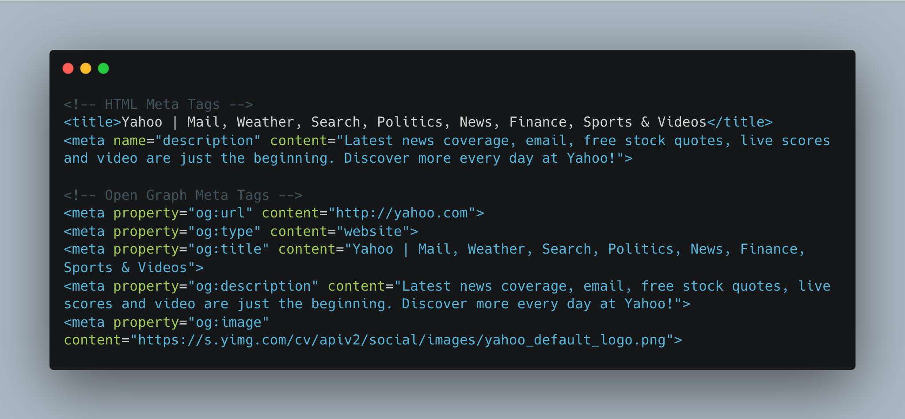

# HTML Metadata

<!--  -->

<!-- [](https://www.npmjs.com/package/@jcottam/html-metadata) -->

[](https://en.wikipedia.org/wiki/ISC_license)
[](http://www.johnryancottam.com)

<!--  -->

The `@jcottam/html-metadata` module is a JavaScript library that simplifies the extraction of HTML Meta and OpenGraph tags from HTML content or URLs. These tags provide structured metadata for webpages, particularly useful for social media sharing and SEO. Both tags improve visibility and appearance on social media and search engines.


  



To report a bug or request a feature please open an issue or pull request in GitHub.

## Features

- Blazingly fast
- Works in both Node.js and browser environments
- Written in TypeScript for type safety
- Extract HTML Meta and OpenGraph tags from HTML or URLs
- Parse and retrieve metadata like `og:title`, `og:description`, `og:image`, etc.
- Easy integration into web applications
- Support for error handling and customization

## Returns

- meta tags
- favicons
- citations, per the Google Scholar spec
- Open Graph Protocol (og:) Tags
- Twitter Card Tags
- JSON-LD
- h1-h6 tags
- img tags
- automatic charset detection & decoding (optional)
- the full response body as a string of html (optional)

```
<link rel="apple-touch-icon" href="" sizes="" type="">
<link rel="icon" href="" sizes="" type="">
<meta name="author" content="">
<link rel="author" href="">
<link rel="canonical" href="">
<meta name ="description" content="">
<link rel="publisher" href="">
<meta name ="robots" content="">
<link rel="shortlink" href="">
<title></title>
<html lang="en">
<html dir="rtl">
```

## Installation

```bash
npm install @jcottam/html-metadata
```

## Integration (ES6)

### Extract tags from a URL

```
import { extractFromUrl } from "@jcottam/html-metadata";

const data = await extractFromUrl("https://www.yahoo.com");
```

### Extract tags from an HTML string

Useful in serverless environments like Cloudflare Workers.

```
import { extractFromHTML } from "@jcottam/html-metadata";

const data = extractFromHTML("<html><head><meta property='og:title' content='Hello World' /></head></html>");
```

## Integration (CommonJS)

### Extract tags from a URL

```
const { extractFromUrl } = require("@jcottam/html-metadata");

extractFromUrl("https://www.yahoo.com").then((data) => console.log(data));
```

### Extract tags from an HTML string

Useful in serverless environments like Cloudflare Workers where passing a `Response` object is required.

```
const { extractFromHTML } = require("@jcottam/html-metadata");

const data = extractFromHTML(
  "<html><head><meta property='og:title' content='Hello World' /></head></html>"
);
```

## Third Party Tools

The module utilizes the following third-party tools for testing and functionality:

- [Jest](https://www.npmjs.com/package/jest): A delightful JavaScript testing framework for unit and integration testing.
- [Cheerio](https://www.npmjs.com/package/cheerio): A fast, flexible, and lean implementation of core jQuery designed for server-side Node.js.
- [Markdwown-Badges](https://ileriayo.github.io/markdown-badges/): Badges for your personal developer branding, profile, and projects.
<!-- - [Axios](https://www.npmjs.com/package/axios): A promise-based HTTP client for making HTTP requests in Node.js and browser environments. -->

## Contributing

We welcome contributions to the @jcottam/html-metadata module! If you'd like to contribute, please follow these guidelines:

1. [Fork the repository](#forking-the-repository) and create a branch.
1. [Make your changes](#making-changes) and ensure that the code style and tests pass.
1. [Submit a pull request](#issuing-a-pull-request) with a detailed description of your changes.

### Forking the Repository

Click on the "Fork" button in the top right corner of the repository page. This will create a copy of the repository under your GitHub account.

### Cloning the Forked Repository

```bash
git clone https://github.com/your-username/@jcottam/html-metadata.git
```

### Making Changes

Create a new branch to work on your changes:

```bash
git checkout -b feature-branch
```

Make your desired changes to the codebase, documentation, or any other relevant files.

#### Build

```
npm install
npm run build
```

#### Test

```
npm run test
```

### Committing Changes

1. Stage the changes you have made:

```bash
git add .
```

2. Commit the staged changes with a descriptive message:

```bash
git commit -m "Add feature XYZ"
```

### Pushing Changes

```bash
git push origin feature-branch
```

### Issuing a Pull Request

1. Visit your forked repository on GitHub.
2. Click on the "New pull request" button next to the branch selection drop-down.
3. Select the base branch (usually the main branch of the original repository) and the compare branch (your feature branch).
4. Provide a descriptive title and detailed description of your changes in the pull request.
5. Click on the "Create pull request" button to submit your pull request for review.

### Review and Collaboration

1. The maintainers of the original repository will review your pull request.
2. Any feedback or changes required will be communicated through comments on the pull request.
3. Once the changes are approved, your pull request will be merged into the main repository.
